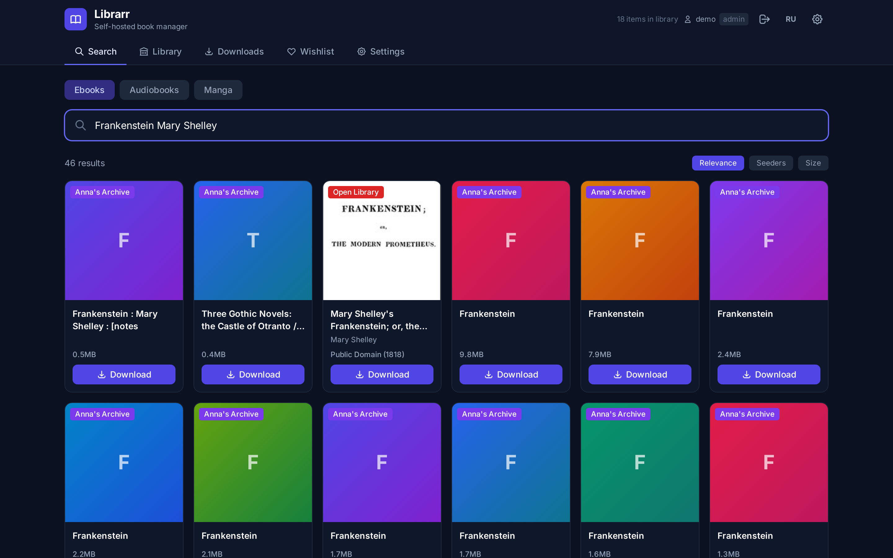
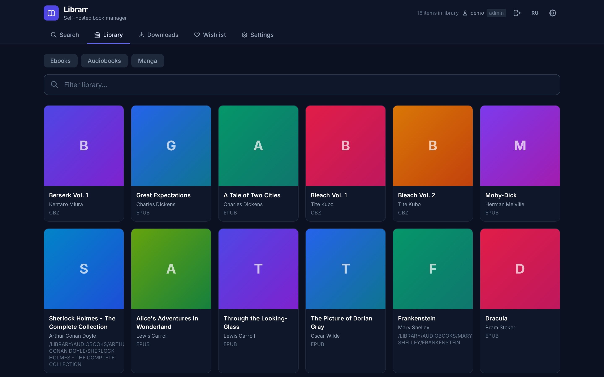
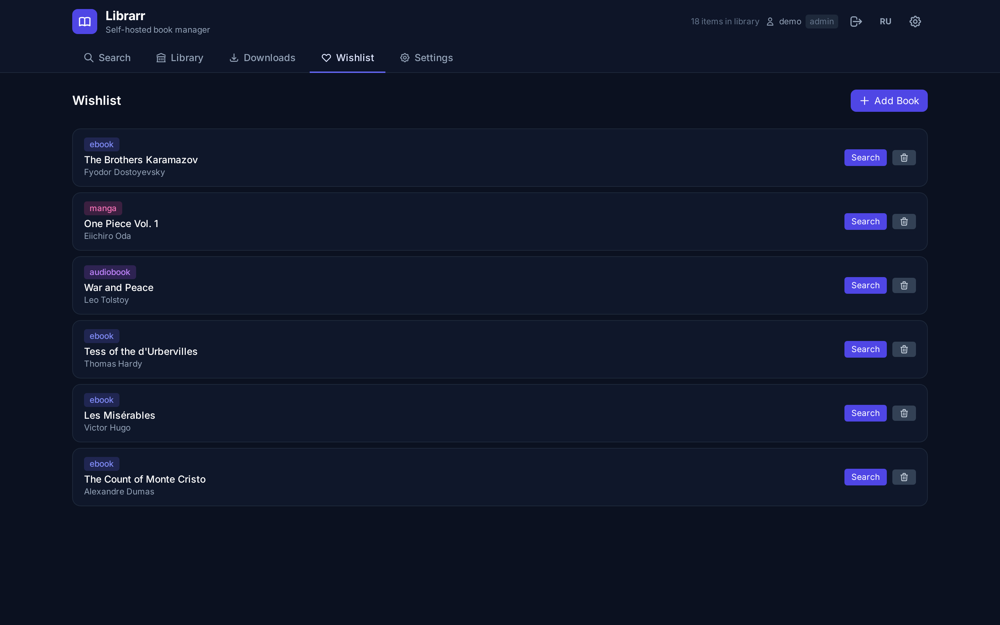
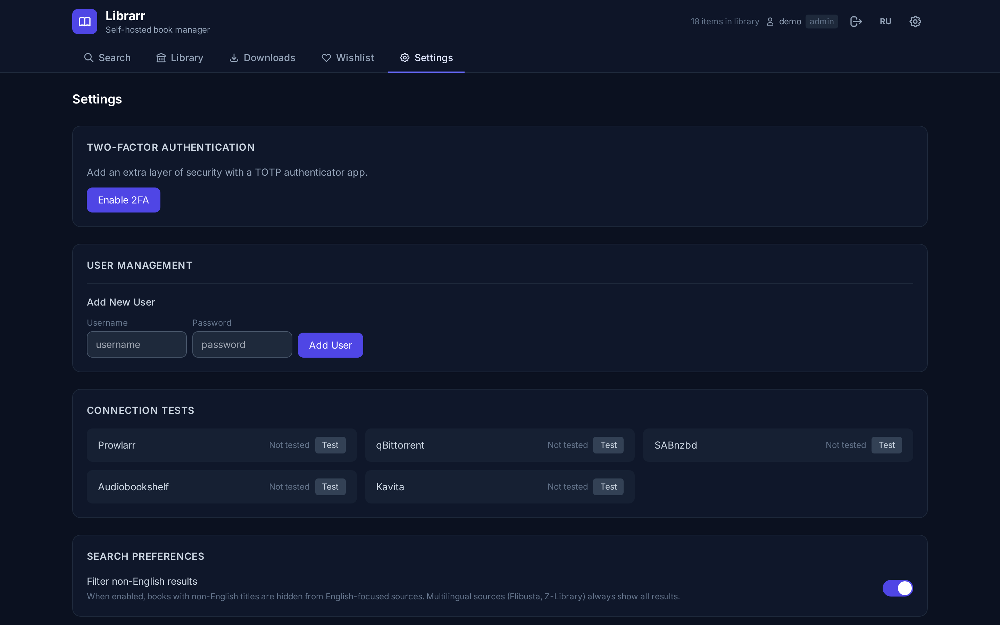

# Librarr

[](https://github.com/JeremiahM37/librarr/actions/workflows/test.yml)
[](https://github.com/JeremiahM37/librarr/releases)
[](https://goreportcard.com/report/github.com/JeremiahM37/librarr)
[](https://opensource.org/licenses/MIT)

**The missing *arr for books.** Self-hosted book, audiobook, and manga search and download manager -- like Sonarr/Radarr but for your reading library.

Librarr searches all configured indexers in parallel, scores results by confidence, and auto-imports into your Calibre, Audiobookshelf, Kavita, or Komga library. Single ~17MB Go binary, no runtime dependencies — **~14MB RSS idle** in a real homelab[^1], typically 10-20× lower than the .NET-based *arr apps.

[^1]: Measured on v1.1.0 in an LXC on Debian 12 (Mar 2026). Reference: Sonarr 4.x ≈ 240MB, Radarr 5.x ≈ 220MB on the same host.

## Screenshots

| Search | Library |
|---|---|
|  |  |

| Wishlist | Settings |
|---|---|
|  |  |

## Why Librarr?

- **Import your Goodreads or StoryGraph library** via CSV and bulk-download everything
- **Request workflow** -- users request books, admins approve, downloads happen automatically (like Jellyseerr for books)
- **Quality profiles** -- rank formats (EPUB > PDF > MOBI), auto-upgrade when a better version appears
- **Author monitoring** -- follow authors and get notified when new releases are found
- **Series auto-complete** -- detects gaps in series and searches for missing volumes
- **Torznab API** -- add Librarr as an indexer in Prowlarr or Readarr (it works both ways)
- **OPDS 1.2 feed** -- browse your library from any e-reader app
- **Tiny footprint** -- ~14MB idle RSS, runs comfortably on a Pi or any thermally-constrained mini-PC

## Features

### Search and Scoring

- **Pluggable indexer registry** -- driver kinds listed below; default endpoints are fetched at startup from the `librarr-sources` companion repo and overrideable at runtime via `LIBRARR_SOURCES_URL` / `LIBRARR_SOURCES_PATH`
- **Confidence scoring** -- 0-100 score with breakdown (title match, author match, format, seeders, file size)
- **Quality profiles** -- define format ranking and preferred attributes, auto-upgrade existing downloads
- **Release profiles** -- preferred and excluded words for fine-grained filtering
- **Blocklist** -- failed downloads are auto-blocked to prevent retries; manual entries supported

### Download Management

- **4 download clients** -- qBittorrent, Transmission, Deluge, SABnzbd with priority ordering
- **Request/approval workflow** -- pending, approved, searching, downloading, completed states with per-request notifications
- **Scheduled wishlist searches** -- background scheduler auto-searches and downloads wishlist items on a configurable interval
- **Torrent completion watcher** -- polls download client, auto-imports completed downloads
- **Dead letter retry** -- failed jobs can be retried individually or in bulk

### Library Management

- **Auto-import pipeline** -- organize files by author/title, rename on import (configurable pattern), scan into Calibre/Audiobookshelf/Kavita/Komga
- **Series auto-complete** -- detect gaps in series, search for and download missing books
- **Author monitoring** -- follow authors, periodically check for new releases, auto-notify
- **Reading history** -- track what you've read with stats (books per month, pages, completion rate)
- **Tags** -- organize library items with custom tags for filtering and grouping
- **Series grouping** -- groups related books/volumes in the library view
- **EPUB verification** -- checks title word overlap to detect wrong-book downloads

### Notifications and Webhooks

- **In-app notifications** -- persistent alerts for downloads, requests, failures, and author releases
- **Discord webhooks** -- rich embeds for download events, request updates, and errors
- **Generic webhooks** -- JSON payloads for any webhook-compatible service
- **Configurable events** -- choose which events trigger notifications

### Import and Export

- **Goodreads CSV import** -- import your shelves, auto-download "to-read" books
- **StoryGraph CSV import** -- import your reading list
- **Library export** -- JSON and CSV export for library, wishlist, and requests
- **Backup and restore** -- full database backup with one-click restore

### APIs and Integrations

- **Torznab/Newznab API** at `/torznab/api` -- add as indexer in Prowlarr, Readarr, or any compatible app
- **OPDS 1.2 feed** at `/opds` -- browse and download from e-readers (KOReader, Moon+ Reader, Librera)
- **Prometheus metrics** at `/metrics` -- request counts, download stats, source health, library size
- **REST API** -- full JSON API for all operations (see API section below)

### Security and Multi-User

- **Multi-user auth** -- session login with bcrypt passwords and admin/user roles
- **TOTP 2FA** -- RFC 6238 time-based one-time passwords with QR code setup
- **OIDC / SSO** -- OpenID Connect for Authelia, Keycloak, Authentik, and others
- **API key auth** -- `X-Api-Key` header or `?apikey=` parameter for programmatic access
- **Rate limiting** -- per-endpoint rate limits with configurable thresholds
- **Security headers** -- X-Content-Type-Options, X-Frame-Options, CORS, request size limits

### UI and Admin

- **Modern dark UI** -- Tailwind CSS, mobile-responsive, single-page app
- **Admin dashboard** -- library stats, source health, activity log, system info
- **Bulk operations** -- retry or cancel multiple downloads at once
- **File uploads** -- drag and drop ebooks/audiobooks, auto-organize and library scan
- **Connection tests** -- verify Prowlarr, qBittorrent, SABnzbd, Audiobookshelf, Kavita connectivity

### Deployment

- **Single static binary** -- ~17MB, zero CGO, pure-Go SQLite (`modernc.org/sqlite`)
- **Docker-ready** -- minimal Alpine image, runs as non-root user
- **Cross-platform** -- Linux, macOS, Windows; amd64, arm64, armv7

## Search Sources

Librarr ships with **driver implementations** -- the protocols it can speak. The list of active indexers, their endpoints, mirrors, and enabled flags lives in a JSON registry, hosted in the [`librarr-sources`](https://github.com/JeremiahM37/librarr-sources) companion repo and fetched at startup (similar to how Prowlarr syncs its indexer definitions). The binary itself ships no embedded registry. After the first successful fetch the registry is cached on disk so subsequent restarts work offline. To use a different registry, set `LIBRARR_SOURCES_URL` (another HTTP source) or `LIBRARR_SOURCES_PATH` (a local file).

| Driver | Used for |
|--------|----------|
| Torznab / Newznab | Prowlarr-managed indexers (any Torznab-compatible source) |
| OPDS 1.2 catalogs | Library, archive, and OPDS-acquisition feeds |
| Public JSON / RSS APIs | Open metadata APIs, public RSS feeds |
| Direct-download with MD5/key lookup | Archive sites that key downloads by content hash |
| Authenticated forum / tracker | Private trackers (user supplies credentials) |
| Library-card-style API | Account-gated catalogs (user supplies endpoint + credentials) |
| Web-novel crawler (`lncrawl`) | Web-novel sites with chapter pagination |
| HTML scrape with regex extractor | Sites without a structured API |

To add or remove a specific indexer endpoint, edit the registry -- no code changes required.

## Quick Start

### Docker (recommended)

```yaml
services:
  librarr:
    image: ghcr.io/jeremiahm37/librarr:latest
    ports:
      - "5050:5050"
    volumes:
      - ./data:/data
      - /path/to/ebooks:/books/ebooks
      - /path/to/audiobooks:/books/audiobooks
      - /path/to/manga:/books/manga
    environment:
      - AUTH_USERNAME=admin
      - AUTH_PASSWORD=changeme
      - API_KEY=your-api-key-here
      - QB_URL=http://qbittorrent:8080
      - QB_USER=admin
      - QB_PASS=changeme
      - PROWLARR_URL=http://prowlarr:9696
      - PROWLARR_API_KEY=your-prowlarr-api-key
    restart: unless-stopped
```

```bash
docker compose up -d
```

### Binary

```bash
# Download from releases
curl -LO https://github.com/JeremiahM37/librarr/releases/latest/download/librarr_linux_amd64.tar.gz
tar xzf librarr_linux_amd64.tar.gz

# Configure
export AUTH_USERNAME=admin
export AUTH_PASSWORD=changeme
export QB_URL=http://localhost:8080
# ... set other env vars as needed

# Run
./librarr
```

Open `http://localhost:5050` in your browser.

## Configuration

All configuration is via environment variables. Every variable has a sensible default.

### Server

| Variable | Default | Description |
|----------|---------|-------------|
| `LIBRARR_PORT` | `5050` | HTTP listen port |
| `LIBRARR_DB_PATH` | `/data/librarr.db` | SQLite database path |
| `SETTINGS_FILE` | `/data/settings.json` | Persistent settings file |

### Authentication

| Variable | Default | Description |
|----------|---------|-------------|
| `AUTH_USERNAME` | | Login username (enables session auth) |
| `AUTH_PASSWORD` | | Login password |
| `API_KEY` | | API key for programmatic access (`X-Api-Key` header or `?apikey=` param) |

### OIDC / SSO

| Variable | Default | Description |
|----------|---------|-------------|
| `OIDC_ENABLED` | `false` | Enable OpenID Connect login |
| `OIDC_PROVIDER_NAME` | `SSO` | Button label on login page |
| `OIDC_ISSUER` | | OIDC issuer URL |
| `OIDC_CLIENT_ID` | | OAuth2 client ID |
| `OIDC_CLIENT_SECRET` | | OAuth2 client secret |
| `OIDC_REDIRECT_URI` | | Callback URL (`https://librarr.example.com/auth/oidc/callback`) |
| `OIDC_AUTO_CREATE_USERS` | `true` | Auto-create users on first OIDC login |
| `OIDC_DEFAULT_ROLE` | `user` | Default role for OIDC-created users |
| `OIDC_PROXY_HEADERS_ENABLED` | `false` | Trust Authentik identity headers from a reverse proxy |

When `OIDC_PROXY_HEADERS_ENABLED=true` and Librarr sits behind a trusted reverse
proxy that injects Authentik headers like `X-Authentik-Username`, it will treat
those requests as an authenticated SSO session, auto-provision the local user if
needed, and skip the manual "Login with SSO" click. Enable this only for
proxy-gated deployments.
Local logout only clears Librarr's session cookie; if the proxy keeps sending
the identity header, the next request will sign the browser back in.

### Download Clients

| Variable | Default | Description |
|----------|---------|-------------|
| `QB_URL` | | qBittorrent Web UI URL |
| `QB_USER` | `admin` | qBittorrent username |
| `QB_PASS` | | qBittorrent password |
| `QB_SAVE_PATH` | `/downloads` | Ebook download path (inside qBit container) |
| `QB_CATEGORY` | `librarr` | Torrent category for ebooks |
| `QB_AUDIOBOOK_SAVE_PATH` | `/audiobooks-incoming` | Audiobook download path |
| `QB_AUDIOBOOK_CATEGORY` | `audiobooks` | Torrent category for audiobooks |
| `QB_MANGA_SAVE_PATH` | `/manga-incoming` | Manga download path |
| `QB_MANGA_CATEGORY` | `manga` | Torrent category for manga |
| `QB_PRIORITY` | `1` | Download client priority (lower = preferred) |
| `REMOVE_TORRENT_AFTER_IMPORT` | `true` | Remove torrent from qBittorrent after a successful import. Set to `false` to keep seeding (required for private trackers with seed-time minimums). |
| `SABNZBD_URL` | | SABnzbd URL |
| `SABNZBD_API_KEY` | | SABnzbd API key |
| `SABNZBD_CATEGORY` | `librarr` | NZB download category |
| `SAB_PRIORITY` | `2` | Download client priority |

### Prowlarr

| Variable | Default | Description |
|----------|---------|-------------|
| `PROWLARR_URL` | | Prowlarr URL |
| `PROWLARR_API_KEY` | | Prowlarr API key |

### Library Imports

| Variable | Default | Description |
|----------|---------|-------------|
| `CALIBRE_LIBRARY_PATH` | | Path to Calibre library (auto-import via `calibredb`) |
| `CALIBRE_URL` | | Calibre-Web URL |
| `KAVITA_URL` | | Kavita server URL |
| `KAVITA_USER` | | Kavita username |
| `KAVITA_PASS` | | Kavita password |
| `KAVITA_LIBRARY_PATH` | | Kavita ebook library path |
| `KAVITA_MANGA_LIBRARY_PATH` | | Kavita manga library path |
| `KAVITA_PUBLIC_URL` | | Kavita URL for external links |
| `ABS_URL` | | Audiobookshelf server URL |
| `ABS_TOKEN` | | Audiobookshelf API token |
| `ABS_LIBRARY_ID` | | Audiobookshelf audiobook library ID |
| `ABS_EBOOK_LIBRARY_ID` | | Audiobookshelf ebook library ID |
| `ABS_PUBLIC_URL` | | Audiobookshelf URL for external links |
| `KOMGA_URL` | | Komga server URL |
| `KOMGA_USER` | | Komga username |
| `KOMGA_PASS` | | Komga password |
| `KOMGA_LIBRARY_ID` | | Komga library ID |
| `KOMGA_LIBRARY_PATH` | | Komga library path |

### File Organization

| Variable | Default | Description |
|----------|---------|-------------|
| `FILE_ORG_ENABLED` | `true` | Auto-organize downloaded files |
| `EBOOK_DIR` | `/books/ebooks` | Organized ebook destination |
| `AUDIOBOOK_DIR` | `/books/audiobooks` | Organized audiobook destination |
| `MANGA_DIR` | `/books/manga` | Organized manga destination |
| `INCOMING_DIR` | `/data/incoming` | Incoming file staging directory |
| `MANGA_INCOMING_DIR` | `/data/manga-incoming` | Manga incoming staging directory |

### Sources Registry

| Variable | Default | Description |
|----------|---------|-------------|
| `LIBRARR_SOURCES_URL` | (built-in default points at `librarr-sources`) | URL of a JSON sources registry, fetched at startup |
| `LIBRARR_SOURCES_PATH` | | Local path to a sources registry JSON file; takes precedence over URL |

Resolution order on startup: `LIBRARR_SOURCES_PATH` → `LIBRARR_SOURCES_URL` → built-in default URL → on-disk cache (`<LIBRARR_DB_PATH dir>/sources-cache.json`) → empty registry. Successful URL fetches are cached so subsequent restarts work offline. If you set `LIBRARR_SOURCES_URL`, your value replaces the default — it does not stack on top of it.

Legacy per-source env vars (e.g. `PROWLARR_URL` and other per-driver overrides) continue to be honored and override values loaded from the registry.

### Search / Downloads

| Variable | Default | Description |
|----------|---------|-------------|
| `MIN_TORRENT_SIZE_BYTES` | `10000` | Minimum torrent size filter (10 KB) |
| `MAX_TORRENT_SIZE_BYTES` | `2000000000` | Maximum torrent size filter (2 GB) |
| `MAX_RETRIES` | `2` | Download retry attempts |
| `RETRY_BACKOFF_SECONDS` | `60` | Seconds between retries |
| `CIRCUIT_BREAKER_THRESHOLD` | `3` | Failures before disabling a source |
| `CIRCUIT_BREAKER_TIMEOUT` | `300` | Seconds before re-enabling a tripped source |

### Feature Toggles

| Variable | Default | Description |
|----------|---------|-------------|
| `RATE_LIMIT_ENABLED` | `true` | Per-source rate limiting |
| `METRICS_ENABLED` | `true` | Prometheus metrics endpoint |
| `WEBNOVEL_ENABLED` | `true` | Web novel search (requires lncrawl container) |
| `MANGADEX_ENABLED` | `true` | MangaDex search |
| `AUTHOR_MONITOR_ENABLED` | `false` | Background author monitoring |

### Torznab

| Variable | Default | Description |
|----------|---------|-------------|
| `TORZNAB_API_KEY` | | API key for the Torznab endpoint |

## API Endpoints

### Authentication

| Method | Path | Description |
|--------|------|-------------|
| POST | `/api/login` | Session login |
| POST | `/api/login/totp` | TOTP 2FA verification |
| POST | `/api/register` | Register new user |
| POST | `/api/logout` | End session |
| GET | `/api/auth/status` | Current auth state |

### User Management (admin)

| Method | Path | Description |
|--------|------|-------------|
| GET | `/api/users` | List all users |
| PATCH | `/api/users/{id}` | Update user role/status |
| DELETE | `/api/users/{id}` | Delete user |

### TOTP 2FA

| Method | Path | Description |
|--------|------|-------------|
| POST | `/api/totp/setup` | Generate TOTP secret + QR code |
| POST | `/api/totp/verify` | Verify and enable TOTP |
| POST | `/api/totp/disable` | Disable TOTP |
| GET | `/api/totp/status` | Check if TOTP is enabled |

### Search

| Method | Path | Description |
|--------|------|-------------|
| GET | `/api/search?q=` | Search ebooks across all sources |
| GET | `/api/search/audiobooks?q=` | Search audiobooks |
| GET | `/api/search/manga?q=` | Search manga |

### Downloads

| Method | Path | Description |
|--------|------|-------------|
| POST | `/api/download` | Download a direct-download result |
| POST | `/api/download/torrent` | Download a torrent result |
| POST | `/api/download/annas` | Download via content-hash (MD5/key) lookup |
| POST | `/api/download/audiobook` | Download an audiobook |
| GET | `/api/downloads` | List active/completed downloads |
| DELETE | `/api/downloads/torrent/{hash}` | Remove a torrent download |
| DELETE | `/api/downloads/novel/{jobID}` | Remove a novel download job |
| POST | `/api/downloads/clear` | Clear finished downloads |
| POST | `/api/downloads/jobs/{id}/retry` | Retry a failed download |

### Library

| Method | Path | Description |
|--------|------|-------------|
| GET | `/api/library` | List ebooks in library |
| GET | `/api/library/audiobooks` | List audiobooks |
| GET | `/api/library/manga` | List manga |
| DELETE | `/api/library/book/{id}` | Remove ebook |
| DELETE | `/api/library/audiobook/{id}` | Remove audiobook |
| GET | `/api/stats` | Library statistics |
| GET | `/api/activity` | Recent activity log |

### Requests

| Method | Path | Description |
|--------|------|-------------|
| POST | `/api/requests` | Create a book request |
| GET | `/api/requests` | List all requests |
| GET | `/api/requests/{id}` | Get request details |
| PUT | `/api/requests/{id}/approve` | Approve request (admin) |
| PUT | `/api/requests/{id}/cancel` | Cancel request |
| PUT | `/api/requests/{id}/retry` | Retry failed request (admin) |
| PUT | `/api/requests/{id}/select` | Select search result (admin) |
| DELETE | `/api/requests/{id}` | Delete request (admin) |

### Wishlist

| Method | Path | Description |
|--------|------|-------------|
| GET | `/api/wishlist` | List wishlist items |
| POST | `/api/wishlist` | Add item to wishlist |
| DELETE | `/api/wishlist/{id}` | Remove from wishlist |

### Notifications

| Method | Path | Description |
|--------|------|-------------|
| GET | `/api/notifications` | List notifications |
| GET | `/api/notifications/unread` | Unread count |
| PUT | `/api/notifications/{id}/read` | Mark as read |
| PUT | `/api/notifications/read-all` | Mark all as read |
| DELETE | `/api/notifications/{id}` | Delete notification |

### Quality Profiles

| Method | Path | Description |
|--------|------|-------------|
| GET | `/api/quality-profiles` | List quality profiles |
| GET | `/api/quality-profiles/default` | Get default profile |
| POST | `/api/quality-profiles` | Create profile (admin) |
| PUT | `/api/quality-profiles/{id}` | Update profile (admin) |
| DELETE | `/api/quality-profiles/{id}` | Delete profile (admin) |

### Release Profiles

| Method | Path | Description |
|--------|------|-------------|
| GET | `/api/release-profiles` | List release profiles |
| POST | `/api/release-profiles` | Create profile (admin) |
| PUT | `/api/release-profiles/{id}` | Update profile (admin) |
| DELETE | `/api/release-profiles/{id}` | Delete profile (admin) |

### Blocklist

| Method | Path | Description |
|--------|------|-------------|
| GET | `/api/blocklist` | List blocked items |
| POST | `/api/blocklist` | Add entry (admin) |
| DELETE | `/api/blocklist/{id}` | Remove entry (admin) |
| POST | `/api/blocklist/clear` | Clear all (admin) |

### Series

| Method | Path | Description |
|--------|------|-------------|
| GET | `/api/series` | List detected series |
| GET | `/api/series/{name}/missing` | Find missing volumes |
| POST | `/api/series/{name}/search-missing` | Search for missing volumes |

### Authors

| Method | Path | Description |
|--------|------|-------------|
| GET | `/api/authors` | List monitored authors |
| POST | `/api/authors/monitor` | Add author (admin) |
| DELETE | `/api/authors/{id}` | Remove author (admin) |

### Reading History

| Method | Path | Description |
|--------|------|-------------|
| POST | `/api/history` | Add history entry |
| GET | `/api/history` | Get reading history |
| PATCH | `/api/history/{id}` | Update entry |
| DELETE | `/api/history/{id}` | Delete entry |
| GET | `/api/history/stats` | Reading statistics |

### Tags

| Method | Path | Description |
|--------|------|-------------|
| GET | `/api/tags` | List all tags |
| POST | `/api/tags` | Create tag |
| DELETE | `/api/tags/{id}` | Delete tag |
| GET | `/api/library/{id}/tags` | Get item tags |
| POST | `/api/library/{id}/tags` | Add tags to item |
| DELETE | `/api/library/{id}/tags/{tagId}` | Remove tag from item |

### Import / Export

| Method | Path | Description |
|--------|------|-------------|
| POST | `/api/import/csv` | Bulk import from CSV |
| POST | `/api/import/goodreads` | Import Goodreads CSV |
| POST | `/api/import/storygraph` | Import StoryGraph CSV |
| POST | `/api/import/library` | Import library JSON |
| POST | `/api/import/wishlist` | Import wishlist JSON |
| POST | `/api/import/scan` | Scan directory for files |
| POST | `/api/import/files` | Import scanned files |
| GET | `/api/export/library` | Export library as JSON |
| GET | `/api/export/wishlist` | Export wishlist as JSON |
| GET | `/api/export/requests` | Export requests as JSON |

### Backup / Restore

| Method | Path | Description |
|--------|------|-------------|
| POST | `/api/backup/create` | Create backup |
| GET | `/api/backup` | Download latest backup |
| GET | `/api/backup/list` | List backups |
| POST | `/api/restore` | Restore from backup |

### Scheduler

| Method | Path | Description |
|--------|------|-------------|
| GET | `/api/scheduler/status` | Scheduler status and next run |
| POST | `/api/scheduler/run` | Trigger manual run (admin) |
| PUT | `/api/scheduler/config` | Update scheduler config (admin) |

### Webhooks (admin)

| Method | Path | Description |
|--------|------|-------------|
| GET | `/api/webhooks` | List webhook configs |
| POST | `/api/webhooks` | Create webhook |
| DELETE | `/api/webhooks/{id}` | Delete webhook |
| POST | `/api/webhooks/test` | Test webhook delivery |

### Admin

| Method | Path | Description |
|--------|------|-------------|
| GET | `/api/admin/dashboard` | Dashboard stats |
| GET | `/api/admin/activity` | Admin activity log |
| GET | `/api/admin/health` | Source and system health |
| POST | `/api/admin/bulk/retry` | Bulk retry downloads |
| POST | `/api/admin/bulk/cancel` | Bulk cancel downloads |

### Connection Tests (admin)

| Method | Path | Description |
|--------|------|-------------|
| POST | `/api/test/prowlarr` | Test Prowlarr connection |
| POST | `/api/test/qbittorrent` | Test qBittorrent connection |
| POST | `/api/test/audiobookshelf` | Test Audiobookshelf connection |
| POST | `/api/test/kavita` | Test Kavita connection |
| POST | `/api/test/sabnzbd` | Test SABnzbd connection |

### System

| Method | Path | Description |
|--------|------|-------------|
| GET | `/health` | Health check |
| GET | `/metrics` | Prometheus metrics |

## Torznab / Newznab API

Librarr exposes a standard Torznab API at `/torznab/api` that can be added as an indexer in Prowlarr, Readarr, or any Torznab-compatible application.

**Setup in Prowlarr / Readarr:**

1. Go to Settings > Indexers > Add
2. Select "Generic Torznab" (or "Generic Newznab")
3. Set the URL to `http://your-librarr-host:5050/torznab/api`
4. Set the API Key to your `TORZNAB_API_KEY` value
5. Test and save

**Capabilities:** `GET /torznab/api?t=caps` returns the supported search categories and capabilities.

## OPDS Feed

Librarr serves an OPDS 1.2 catalog at `/opds` for e-reader apps (KOReader, Moon+ Reader, Librera, etc.).

| Path | Description |
|------|-------------|
| `/opds` | Catalog root |
| `/opds/books` | Browse all books |
| `/opds/search?q=` | Search the catalog |
| `/opds/download/{id}` | Download a book file |
| `/opds/opensearch.xml` | OpenSearch descriptor |

**Setup:** Add `http://your-librarr-host:5050/opds` as an OPDS catalog in your e-reader. If auth is enabled, enter your Librarr username and password.

## Using Librarr with Claude / MCP

Librarr's REST API is the integration surface, so any [Model Context Protocol](https://modelcontextprotocol.io/) server can expose Librarr's search, download, and library tools to an LLM (Claude Desktop, Claude Code, Open WebUI, Cursor, etc.). There's no built-in MCP server in Librarr — you wire it into the MCP server you already run.

**Auth:** every endpoint accepts an `X-Api-Key` header or `?apikey=` query param. Set `API_KEY` in your `docker-compose.yml` and reuse it from your MCP server.

**Minimal Python example** using [`fastmcp`](https://github.com/jlowin/fastmcp):

```python
# librarr_mcp.py — run as: fastmcp run librarr_mcp.py
import os, httpx
from fastmcp import FastMCP

LIBRARR = os.environ["LIBRARR_URL"]       # e.g. http://librarr.lan:5050
API_KEY = os.environ["LIBRARR_API_KEY"]
HEADERS = {"X-Api-Key": API_KEY}

mcp = FastMCP("librarr")

@mcp.tool()
async def search_books(query: str) -> list[dict]:
    """Search for an ebook across all configured sources."""
    async with httpx.AsyncClient() as c:
        r = await c.get(f"{LIBRARR}/api/search", params={"q": query}, headers=HEADERS)
        return r.json()

@mcp.tool()
async def download_book(result: dict) -> dict:
    """Queue an ebook download. Pass a result object returned by search_books — it
    already contains `source`, `title`, and the source-specific URL field
    (`download_url` / `magnet_url` / `md5` / etc.)."""
    async with httpx.AsyncClient() as c:
        r = await c.post(f"{LIBRARR}/api/download", json=result, headers=HEADERS)
        return r.json()

@mcp.tool()
async def list_downloads() -> list[dict]:
    """List active and recent download jobs with status."""
    async with httpx.AsyncClient() as c:
        r = await c.get(f"{LIBRARR}/api/downloads", headers=HEADERS)
        return r.json()
```

**Register with Claude Desktop / Claude Code** (`~/.claude.json` or `claude_desktop_config.json`):

```json
{
  "mcpServers": {
    "librarr": {
      "command": "fastmcp",
      "args": ["run", "/path/to/librarr_mcp.py"],
      "env": {
        "LIBRARR_URL": "http://librarr.lan:5050",
        "LIBRARR_API_KEY": "your-api-key-here"
      }
    }
  }
}
```

The same pattern works for audiobooks (`/api/search/audiobooks`, `/api/download/audiobook`) and manga (`/api/search/manga`, `/api/download/torrent`). Wrap whichever subset of the [API Endpoints](#api-endpoints) above is useful to your assistant.

## Architecture

Single static binary, zero CGO dependencies, pure-Go SQLite via `modernc.org/sqlite`.

```
cmd/librarr/main.go            Entry point
internal/
  config/config.go              Env var configuration
  db/                           SQLite persistence + migrations
  models/                       Core types (books, downloads, wishlist, requests, etc.)
  api/                          HTTP handlers, router, middleware
    auth.go                     Session auth + bcrypt
    totp.go                     TOTP 2FA (RFC 6238)
    oidc.go                     OpenID Connect / SSO
    search.go                   Search endpoint handlers
    download.go                 Download management
    library.go                  Library CRUD
    requests.go                 Request workflow
    notifications.go            In-app notifications
    qualityprofile.go           Quality profiles
    releaseprofile.go           Release profiles
    blocklist.go                Blocklist management
    tags.go                     Tag management
    history.go                  Reading history
    series.go                   Series detection + auto-complete
    importexport.go             Import/export (JSON, CSV, Goodreads, StoryGraph)
    backup.go                   Database backup/restore
    webhook.go                  Webhook configuration
    opds.go                     OPDS 1.2 feed
    admin.go                    Admin dashboard
    metrics.go                  Prometheus metrics
    csv.go                      CSV bulk import
    ratelimit.go                Per-source rate limiting
    router.go                   Route registration
  search/                       Search source implementations
  download/                     Download manager (qBit, Transmission, Deluge, SABnzbd)
  organize/                     Post-download file organization + library import
  metadata/                     Open Library metadata enrichment
  scheduler/                    Background scheduler, series detector, author monitor
  webhook/                      Webhook sender (Discord + generic)
  torznab/                      Torznab/Newznab API handler
web/
  index.html                    Single-page web UI (Tailwind CSS)
Dockerfile                      Multi-stage Alpine build
.goreleaser.yml                 Cross-platform release builds
```

## License

MIT

## Disclaimer

This software is provided for **educational and personal use only**. Users are responsible for ensuring their use complies with all applicable laws and regulations in their jurisdiction. The developers do not condone or encourage copyright infringement or any illegal activity. This tool does not host, store, or distribute any copyrighted content, and ships with no built-in catalog of indexers -- the list of endpoints to query comes from a user-supplied registry.
